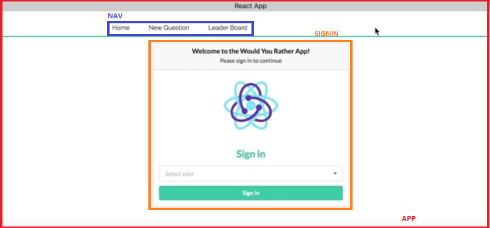
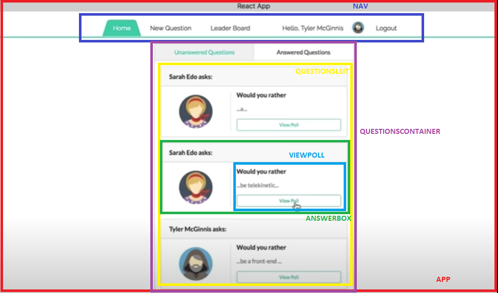
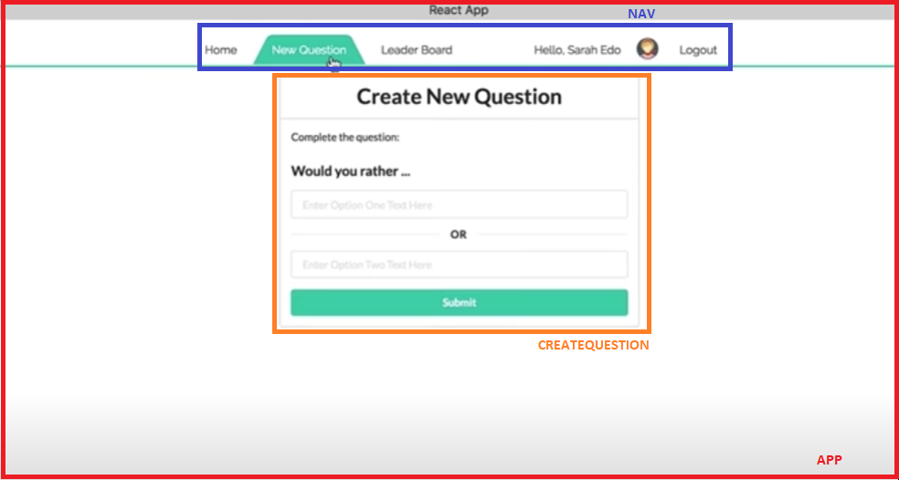
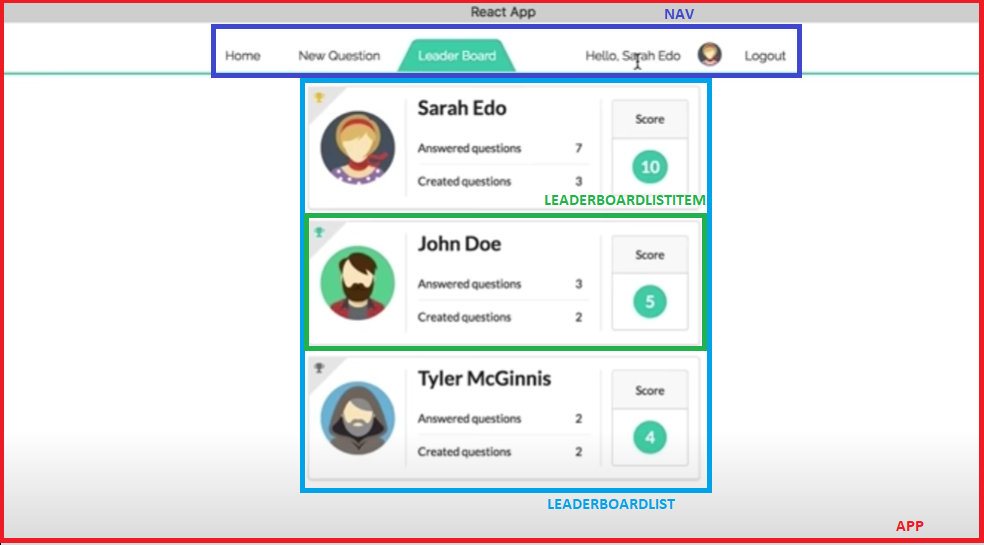
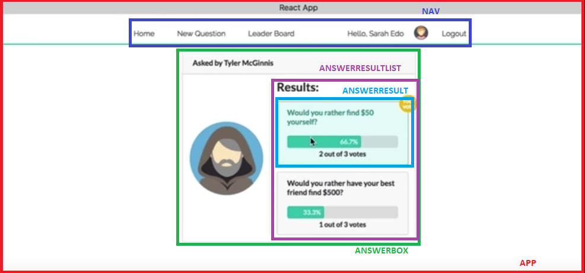
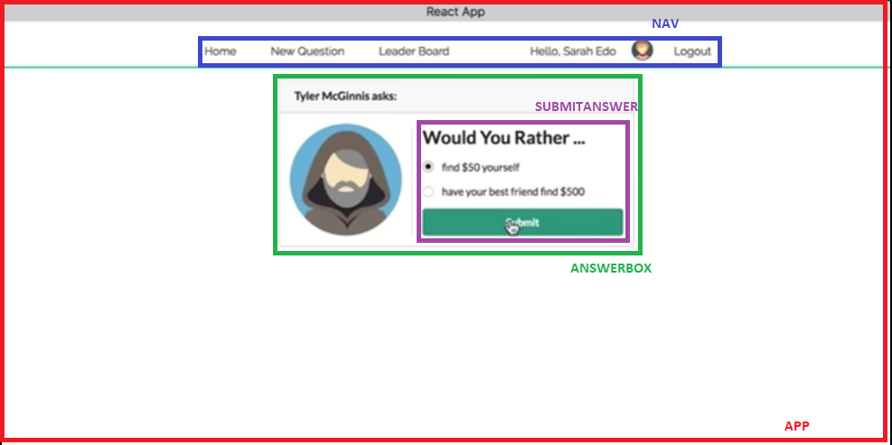

# Would You Rather Project Design

## Views

Based off the [sample app video](https://www.youtube.com/watch?v=xfmSkLAL__Q&feature=emb_logo), the following views can be described:

- Sign in View
- Home View
- New Question View
- Leader Board View
- Poll View

## View Breakdown

### Sign In View



#### Sign In View Requirements
- There should be a way for the user to impersonate/ log in as an existing user. (This could be as simple as having a login box that appears at the root of the application. The user could then select a name from the list of existing users.)
- Once the user logs in, the home page is shown.
- Whenever the user types something in the address bar, the user is asked to log in before the requested page is shown.

### Home View


#### Home View Requirements
- The answered and unanswered polls are both available at the root.
- The user can alternate between viewing answered and unanswered polls.
- The unanswered questions are shown by default.
- The name of the logged in user is visible on the page.
- The user can navigate to the leaderboard.
- The user can navigate to the form that allows the user to create a new poll.

### New Question View


#### New Question View Requirements
- The form is available at `/add`
- The application shows the text “Would You Rather” and has a form for creating two options.
- Upon submitting the form, a new poll is created and the user is taken to the home page.
- The new polling question appears in the correct category on the home page.

### Leader Board View


#### Leader Board View Requirements
- The Leaderboard is available at `/leaderboard`
- Each entry on the leaderboard contains the following:
  - the user’s name;
  - the user’s picture;
  - the number of questions the user asked; and
  - the number of questions the user answered.
- Users are ordered in descending order based on the sum of the number of questions they’ve answered and the number of questions they’ve asked.

### Poll View




### Poll View Requirements
- The details of the poll are available at `questions/:question_id`.
- When a poll is clicked on the home page, the following is shown:
  - the text “Would You Rather”;
  - the picture of the user who posted the polling question; and
  - the two options.
- For answered polls, each of the two options contains the following:
  - the text of the option;
  - the number of people who voted for that option;
  - the percentage of people who voted for that option. 
- The option selected by the logged in user should be clearly marked.
- When the user is logged in, the details of the poll are shown. If the user is logged out, he/she is asked to log in before before being able to access the poll.
- The application asks the user to sign in and shows a 404 page if that poll does not exist. (In other words, if a user creates a poll and then the same or another user tries to access that poll by its url, the user should be asked to sign in and then be shown a 404 page. Please keep in mind that new polls will not be accessible at their url because of the way the backend is set up in this application.) 

## Components List

- App
- Nav
- CreateQuestion
- QuestionContainer
  - QuestionList
- AnswerBox
  - SubmitAnswer
  - AnswerRestultContainer
  - AnswerResult  
  - ViewPoll
- LeaderBoardList
  - LeaderBoardListItem
- SignIn

## Redux Store

### Store Composition
```javascript
{
  loading,
  authedUser,
  users,
  questions
}
```

### Sample Data
#### Users
```javascript
{
  sarahedo: {
    id: 'sarahedo',
    name: 'Sarah Edo',
    avatarURL: ,
    answers: {
      "8xf0y6ziyjabvozdd253nd": 'optionOne',
      "6ni6ok3ym7mf1p33lnez": 'optionTwo',
      "am8ehyc8byjqgar0jgpub9": 'optionTwo',
      "loxhs1bqm25b708cmbf3g": 'optionTwo'
    },
    questions: ['8xf0y6ziyjabvozdd253nd', 'am8ehyc8byjqgar0jgpub9']
  },
  tylermcginnis: {
    id: 'tylermcginnis',
    name: 'Tyler McGinnis',
    avatarURL: ,
    answers: {
      "vthrdm985a262al8qx3do": 'optionOne',
      "xj352vofupe1dqz9emx13r": 'optionTwo',
    },
    questions: ['loxhs1bqm25b708cmbf3g', 'vthrdm985a262al8qx3do'],
  },
  johndoe: {
    id: 'johndoe',
    name: 'John Doe',
    avatarURL: ,
    answers: {
      "xj352vofupe1dqz9emx13r": 'optionOne',
      "vthrdm985a262al8qx3do": 'optionTwo',
      "6ni6ok3ym7mf1p33lnez": 'optionTwo'
    },
    questions: ['6ni6ok3ym7mf1p33lnez', 'xj352vofupe1dqz9emx13r'],
  }
}
```
#### Questions
```javascript
{
  "8xf0y6ziyjabvozdd253nd": {
    id: '8xf0y6ziyjabvozdd253nd',
    author: 'sarahedo',
    timestamp: 1467166872634,
    optionOne: {
      votes: ['sarahedo'],
      text: 'have horrible short term memory',
    },
    optionTwo: {
      votes: [],
      text: 'have horrible long term memory'
    }
  },
  "6ni6ok3ym7mf1p33lnez": {
    id: '6ni6ok3ym7mf1p33lnez',
    author: 'johndoe',
    timestamp: 1468479767190,
    optionOne: {
      votes: [],
      text: 'become a superhero',
    },
    optionTwo: {
      votes: ['johndoe', 'sarahedo'],
      text: 'become a supervillain'
    }
  }
}
```


